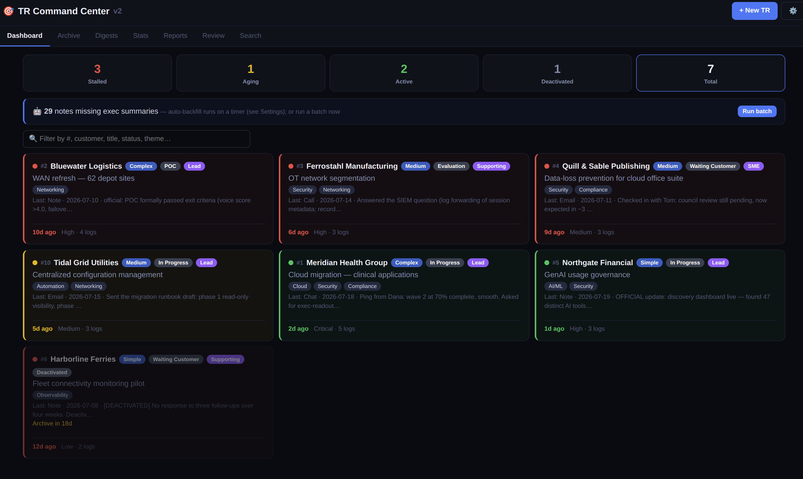

# TR Command Center

> **Flavor branch: `palo-alto`** — ships with Palo Alto Networks SASE
> taxonomy defaults (Prisma Access, SD-WAN, ADEM, …), SASE-flavored demo
> data, and `sfdc` as the official-record tag. For the vendor-neutral
> defaults, use `main`. Only defaults and demo data differ — the app is
> identical, and everything here is editable in Settings anyway.

Local-first **Technical Request (TR)** tracking: log customer/stakeholder
engagements, dump raw interaction notes, and turn them into polished exec
summaries, catch-up digests, period reports, and question-driven reviews —
with **all AI running on your own local models — Ollama, LM Studio, or equivalent — or fully switched off**.
Your data never leaves your network.



Built on three principles:

1. **Local-first.** One Docker container next to (optionally) a local model
   server — Ollama, LM Studio, llama.cpp, vLLM, or anything OpenAI-compatible
   (protocol auto-detected). No cloud AI providers exist in the codebase — the
   server only ever talks to your configured local endpoint, and a single
   settings toggle turns AI off entirely.
2. **Minimal supply chain.** No bundler, no build step for the frontend.
   Server-rendered HTML with [htmx](https://htmx.org) + [Alpine.js](https://alpinejs.dev)
   vendored as two hash-pinned static files (`public/vendor/VENDOR.md`).
   Runtime dependencies: Express and better-sqlite3. That's it.
3. **Deterministic before generative.** Stats, health states, and report
   numbers are computed in code. The model only ever writes narrative from
   those facts plus your tagged "official record" — it cannot invent totals.

## Features

- **Dashboard** — Green/Yellow/Red health per TR from last-contact age,
  short `#N` handles, instant filter box, deactivation with archive countdown
- **Interaction log** — paste raw notes of any size (calls, meetings,
  transcripts); the local model produces customer-facing versions and terse
  exec summaries on demand, with an auto-backfill scheduler for the backlog
- **Audit trail** — every change to status/complexity/priority/role/outcome/
  themes is recorded automatically; each TR shows its full shift history
- **Catch-me-up digests** — per-TR AI summary, cached, auto-generated on
  archival, listed on the Digests page
- **Period reports** — deterministic portfolio stats for any date range +
  optional AI narrative; every narrative run is saved to the Reports page
- **Review engine** — ask up to 10 free-form questions ("where could I have
  improved?") against a scoped slice of the record: date range, role type,
  themes, or hand-picked TRs (`3, 5, 9-12`). Grounded, persisted, reusable
  for self-evals / 6-month reviews / retros
- **Search** — instant FTS5 text search plus semantic search over notes via
  local-model embeddings (in-page explainer covers when to use which)
- **Weekly report** — copy-paste-ready stakeholder update

## Quick start

### Docker (recommended)

```bash
cp .env.example .env   # point AI_URL at your local model server (or ignore — see AI-free mode)
docker compose up -d --build
# http://localhost:3000 — seeds demo data on first run
```

The SQLite database lives on the `trr-data` named volume. Set
`SEED_ON_EMPTY=false` to start empty instead of with demo data.

### Dev

```bash
npm ci
npm run dev        # http://localhost:3000
npm test
```

### Configuration (environment)

| Variable | Default | Purpose |
|----------|---------|---------|
| `PORT` | `3000` | HTTP port |
| `DB_PATH` | `data/trr.db` | SQLite database file |
| `AI_URL` | `http://localhost:11434` | Your local model server (Ollama, LM Studio, llama.cpp, vLLM…) — the only external call the server ever makes. Protocol auto-detected; `OLLAMA_URL` accepted as a legacy alias |
| `AI_MODEL` | `gemma4-16k:latest` | Fast model: per-note exec summaries |
| `AI_DIGEST_MODEL` | `gemma4:26b` | Quality model: digests, reports, reviews (falls back to the fast model on GPU OOM) |
| `AI_EMBED_MODEL` | `nomic-embed-text` | Embeddings for semantic search |
| `SEED_ON_EMPTY` | `true` | Seed demo data when the database is empty |

Everything else is configured **in the GUI** under ⚙️ Settings.

### Reference setup

Built with **Ollama** in mind and verified end-to-end against it (both the
native and OpenAI-compatible APIs). Reference models during development, on
a single 16 GB consumer GPU:

- **`gemma4-16k`** (12B-class, 16k context) — per-note summaries, and the
  automatic fallback when the big model doesn't fit
- **`gemma4:26b`** — digests, period reports, and the review engine (best
  quality; on 16 GB it only fits when the GPU is otherwise idle, which is
  exactly why the OOM fallback exists)
- **`nomic-embed-text`** — semantic-search embeddings

Anything comparable works: a fast mid-size model for summaries, the largest
model your hardware fits for digests/reviews, and any embedding model.
LM Studio and friends are first-class via the OpenAI-compatible API.


### Context windows & scale

The single most important setting, and the least obvious: **Ollama does not size
the context window to your prompt.** Without an explicit `num_ctx` it uses the
model's built-in default — often 2–4k tokens — and *silently discards* whatever
doesn't fit. The request still succeeds; you just get an answer based on a
fraction of what you sent. This app always sends `num_ctx` explicitly, taken from
**Settings → Context budget**, so set it to something your models can actually hold.

| Setting | What it does |
|---|---|
| Quality model context | Window requested for digests/reviews (`num_ctx`) |
| Fast / fallback model context | Same, for the smaller model used on OOM fallback |
| Reserved for answer + scaffolding | Held back per call for the prompt and the reply |
| Max model calls per review run | Guard rail — an oversized run is refused, not silently started |

To raise the ceiling in Ollama, bake a window into a model variant (this is
exactly what a `-16k` / `-128k` style tag is):

```bash
printf 'FROM gemma4:26b\nPARAMETER num_ctx 32768\n' > Modelfile
ollama create gemma4-32k -f Modelfile
```

…or point Settings at a long-context model you already have and set the token
count to match.

**But a bigger window is not the scaling strategy.** VRAM cost grows with
context — a very large window can cost more memory than the weights — and long
prompts get slower and less accurate ("lost in the middle"). So the review
engine **chunks instead**:

- Records are packed into slices sized to your configured window.
- Each question is **mapped** over every slice to pull only relevant evidence.
- Those findings are **reduced** into one answer per question (consolidating in
  rounds if the evidence itself overflows).
- Deterministic stats — counts, win/loss, per-status totals — are computed in
  code and passed whole, so **no number is ever lost to slicing**.

Volume is therefore bounded by *time*, not by context size: 10× the records is
10× the slices, not an impossible prompt. A bigger window just means fewer
slices and a faster run. If the whole scope happens to fit one window, the map
pass is skipped and it's a single call per question.

Before each run the UI shows the plan — records in scope, slices, and total model
calls — and the run executes in the background with live progress, because a
large sweep is minutes-to-hours, not seconds.

**Rules of thumb**

- Start at 16k; raise only when you have VRAM headroom to spare.
- Fewer, larger slices = fewer calls = faster — until VRAM or answer quality suffers.
- Narrowing scope (date range, TR numbers, role, theme) beats brute force every time.
- A run refused for exceeding the call budget is the guard rail working. Narrow
  the scope, or raise the limit deliberately.


## Make it yours — Settings as the use-case dial

"Technical Request" deliberately means whatever you need it to mean. The
taxonomies that drive every form, filter, stat, and review scope are editable
in **Settings → Taxonomies**, so the same tool fits different workflows:

**Pre-sales SE tracking** *(the defaults)*
- Statuses: `New → In Progress → Waiting Customer/Internal → POC → Evaluation → Closed Won/Lost → Archived`
- My roles: `Lead / Supporting / SME / POST` — role type is a review-engine
  scope, so "pre-sale vs post-sale work" is one checkbox
- Value themes: product/technology areas (multi-select per TR)

**Post-sales / delivery work**
- Statuses: `Scoping → In Delivery → Blocked → UAT → Hypercare → Complete → Archived`
- Closed statuses: `Complete, Archived` · Outcomes: `Delivered, Partial, Escalated, Churn Risk`
- Themes: service lines or workstreams

**Generic request / consulting tracker**
- Statuses: `New → Triage → Active → Waiting → Done → Archived`
- Roles: `Owner / Contributor / Reviewer` · Themes: practice areas, clients, or tech domains

Two settings make status renames safe: **Closed statuses** tells the app
which of *your* statuses mean "closed" (drives the Archive tab and health
math), and **Archived status** names the one that triggers the automatic
catch-up digest. Existing TRs keep their stored values if you edit a list.

Also in Settings: health thresholds (green/yellow days, archive window),
the auto-backfill timer, model selection per job, and every prompt template
(summaries, digests, self-eval, review engine) — so tone and grounding rules
are yours to tune.

## Backups & restore

**Settings → Backups & restore** manages full-fidelity snapshots of the
SQLite database (every TR, note, digest, report, review, setting, and
search index — made with `VACUUM INTO`, safe while running):

- **Back up now** — creates a snapshot; each one is downloadable
- **Daily auto-backup** — on by default, with a configurable retention count
- **Restore** — upload a `.db` file or click restore on a stored backup.
  The snapshot is validated, a safety copy of the current database is kept,
  and the swap happens on restart (automatic under Docker/systemd)
- **JSON export** — a portable dump of everything, for scripting or migration

### Recommended practice

1. **Leave daily auto-backup on.** It protects against mistakes — a deleted
   TR or a bad bulk edit is one click from undone (and even a restore keeps
   a safety copy of what it replaced).
2. **Get copies off the box.** Backups live next to the database
   (`data/backups/` on the Docker volume), so they survive mistakes — not a
   dead disk. Every backup is a plain file at a stable URL, so automate it
   from any machine that can reach the app:

   ```bash
   # grab the newest backup (cron-friendly)
   name=$(curl -s http://localhost:3000/api/backups | jq -r '.backups[0].name')
   curl -sO "http://localhost:3000/data/backups/$name"
   ```

   Or bind-mount `./data` instead of a named volume and point
   rsync/restic/Syncthing at `data/backups/`.
3. **Keep `.env` with your off-box copies.** The model-server URL and port
   live there, not in the database — it's the only thing a backup doesn't
   carry.

### Recovery

- **Deleted something?** Settings → Backups → ♻️ restore on the newest
  snapshot. The app restarts and you're back.
- **Lost the host?** Install trcc anywhere (`docker compose up -d --build`),
  open Settings → ♻️ Restore from file, upload your off-box `.db`.
  Everything returns — data, taxonomies, templates, settings.

## AI-free mode

Untick **Settings → Enable AI features** and the app runs with no local
model server at all: AI buttons and panels disappear, AI endpoints are
server-side blocked, semantic search falls back to text search, schedulers
idle. Tracking, health dashboard, audit history, FTS search, stats, weekly
reports, and all previously generated digests/reports/reviews keep working.
Flip it back on any time.

## Architecture

```
src/
  server.ts        Express app + auto-backfill scheduler
  config.ts        env-driven runtime config
  types.ts         domain model + default taxonomies
  db/              better-sqlite3: versioned migrations, repo, seed
  services/
    ai.ts          local model client (Ollama-native + OpenAI-compatible APIs, auto-detected) + GPU-OOM fallback
    digest.ts      deterministic period stats + per-TR digests
    review.ts      scoped, grounded review engine
    search.ts      FTS5 + embedding-based semantic search
  views/           server-rendered pages (template literals, escaped)
  routes/          pages (GET), actions (forms/htmx), api (JSON)
public/
  vendor/          htmx + Alpine, hash-pinned (see VENDOR.md)
  css/app.css      the entire design system, mobile-first
```

Data: SQLite with FTS5 triggers and versioned migrations. JSON API at
`/api/export`, `/api/trrs`, `/api/trr/:id`, `/api/digest`, `/api/reports`,
`/api/models` for scripts and automation.

## Security model

There is deliberately **no auth**: the network is the boundary. Run it on
localhost, a LAN, or behind a VPN/access proxy. Do **not** expose it directly
to the internet.

## License

Apache-2.0 — see [LICENSE](LICENSE).
