# TR Command Center

> **Flavor branch: `palo-alto`** — ships with Palo Alto Networks SASE
> taxonomy defaults (Prisma Access, SD-WAN, ADEM, …), SASE-flavored demo
> data, and `sfdc` as the official-record tag. For the vendor-neutral
> defaults, use `main`. Only defaults and demo data differ — the app is
> identical, and everything here is editable in Settings anyway.

Local-first **Technical Request (TR)** tracking: log customer/stakeholder
engagements, dump raw interaction notes, and turn them into polished exec
summaries, catch-up digests, period reports, and question-driven reviews —
with **all AI running on your own local models — Ollama, LM Studio, or equivalent — or fully switched off**.
Your data never leaves your network.

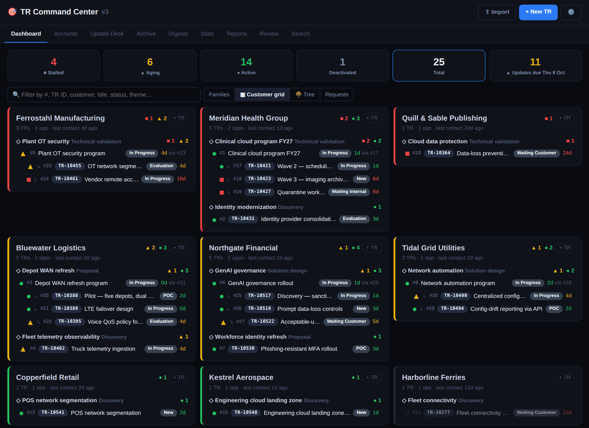

Built on three principles:

1. **Local-first.** One Docker container next to (optionally) a local model
   server — Ollama, LM Studio, llama.cpp, vLLM, or anything OpenAI-compatible
   (protocol auto-detected). No cloud AI providers exist in the codebase — the
   server only ever talks to your configured local endpoint, and a single
   settings toggle turns AI off entirely.
2. **Minimal supply chain.** No bundler, no build step for the frontend.
   Server-rendered HTML with [htmx](https://htmx.org) + [Alpine.js](https://alpinejs.dev)
   vendored as two hash-pinned static files (`public/vendor/VENDOR.md`).
   Runtime dependencies: Express and better-sqlite3. That's it.
3. **Deterministic before generative.** Stats, health states, and report
   numbers are computed in code. The model only ever writes narrative from
   those facts plus your tagged "official record" — it cannot invent totals.

## What's new in 3.0

2.x kept a flat list of requests. 3.0 tracks the work the way it is actually
organised — customers, opportunities, programs, and the individual requests
under them — and turns the weekly status update from a chore into a workflow.

| | 2.x | 3.0 |
|---|---|---|
| **Structure** | One flat list; a TR's title doubled as its opportunity | Customer → Opportunity → parent TR → child TRs, each carrying its upstream **TR ID** |
| **Dashboard** | One card per TR | Families, a customer grid, a collapsible tree, and a Requests view of just the TRs doing the work |
| **Weekly updates** | Copy a 7-day roll-up off the Reports page | The **Update Desk**: who owes an update, a draft per TR ID (AI or plain) built from everything since the last *posted* one, regenerate, one paste-ready block, mark posted |
| **Getting data in** | Type it in | **Paste rows from Google Sheets** / CSV (or plain text the local model reads), preview every change, undo |
| **Catching up** | A digest per TR | A versioned, incremental **summary to date** for a TR, a program, an opportunity, or a customer |
| **Logs** | One log, one TR; "sensitive" was only a badge | One log can cover several TRs; 🚩 **flagged logs are never passed to any model** |
| **History** | Field changes per TR | Plus an opportunity audit trail: moves, renames, and stage changes |
| **Upgrading** | — | A one-time **restructure wizard** builds the hierarchy from your 2.x TRs and fills TR IDs from your notes — previewed, and undoable |

Every change is in the [CHANGELOG](CHANGELOG.md); upgrade steps are in
[UPGRADE.md](UPGRADE.md). Screenshots use the vendor-neutral demo data from the `main` flavor.

### See the portfolio the way it is organised

<table>
<tr><th>2.2 — one card per TR</th><th>3.0 — customer › opportunity › parent › child</th></tr>
<tr><td valign="top">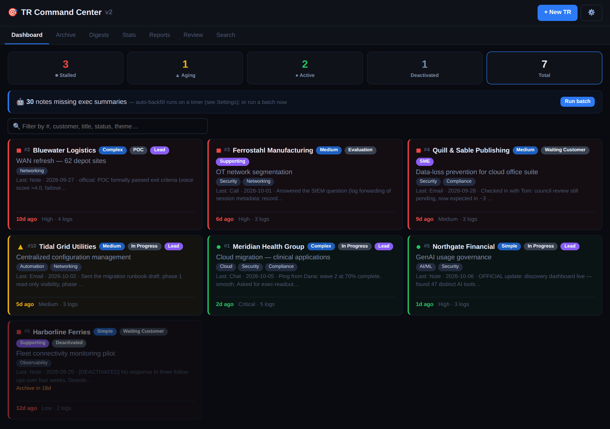</td>
<td valign="top">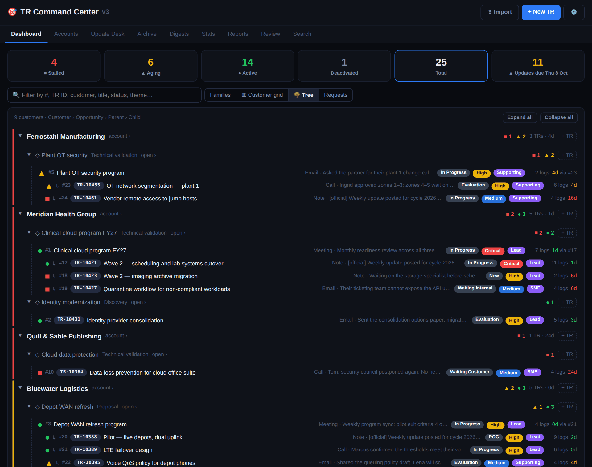</td></tr>
</table>

Health still comes from last-contact age, and a parent is green while any of
its children is being worked. Pick the view that suits the moment: families,
a tile per customer, the full tree, or only the requests.

### The Update Desk

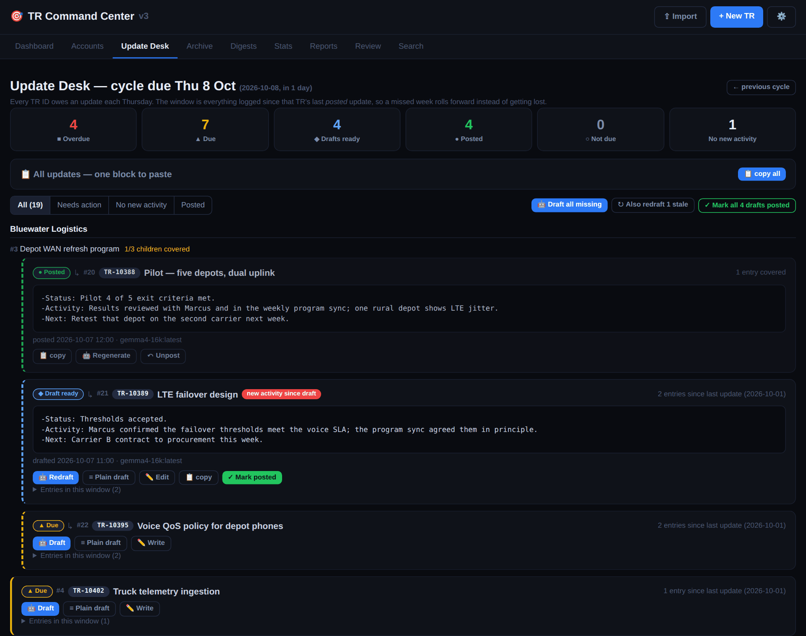

Every TR ID owes an update each cycle (Thursday by default). The desk shows what
is overdue, due, drafted, or posted; drafts combine everything logged since
that TR's last posted update, so a missed week rolls forward instead of being
lost. Draft them one at a time or all at once, edit or regenerate any of them,
copy the whole cycle as one block, and mark them posted. The prompt is yours to
shape to whatever format your tracking system wants.

### Programs: a parent TR and its requests

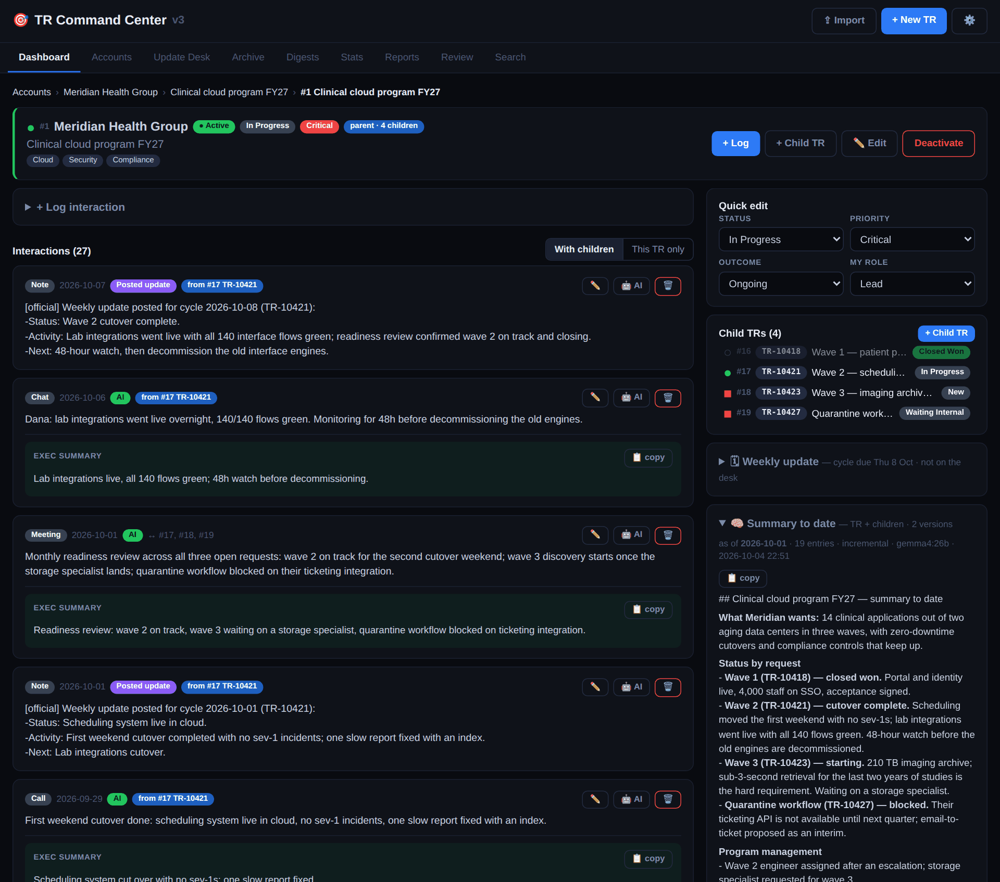

The parent carries the program-management side — escalations, resourcing,
coordination — while the work is logged on its children. Its page shows the
whole family's activity, which child each log came from, and a summary to date
that is revised incrementally as new entries arrive.

### Opportunities, with a summary and an audit trail

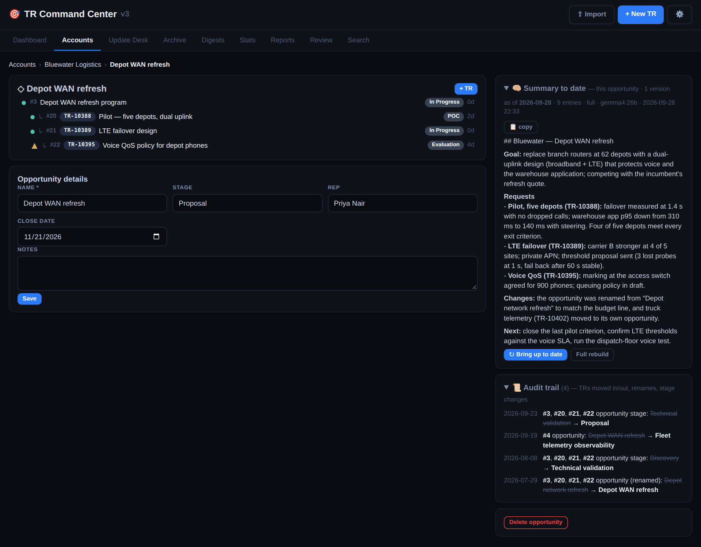

### Import from a paste

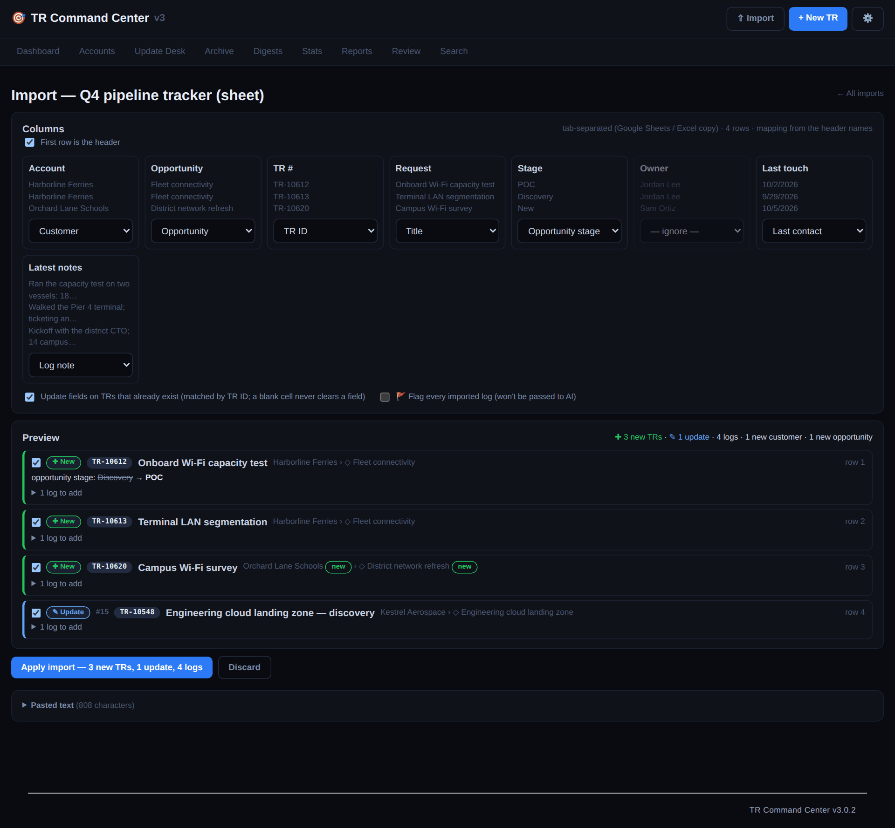

Copy rows out of Google Sheets and paste. Columns are matched for you (by
header, or by the local model), and the preview lists every TR, log, customer,
and opportunity before anything is saved. Pasting the same sheet again only
adds what is new, and an applied import can be undone.

### Coming from 2.x

<table>
<tr><th>The restructure wizard</th><th>After: the same TRs as a hierarchy</th></tr>
<tr><td valign="top">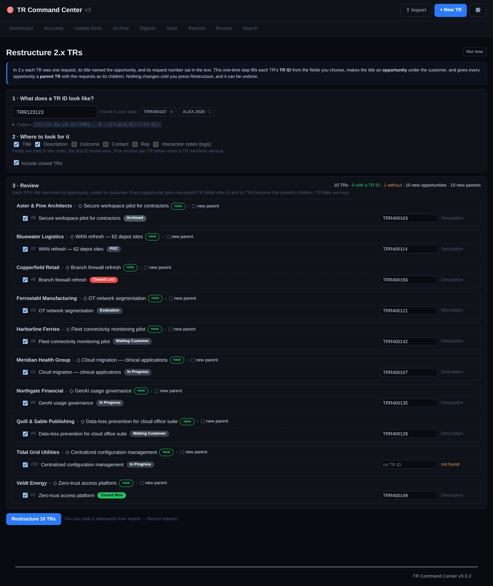</td>
<td valign="top">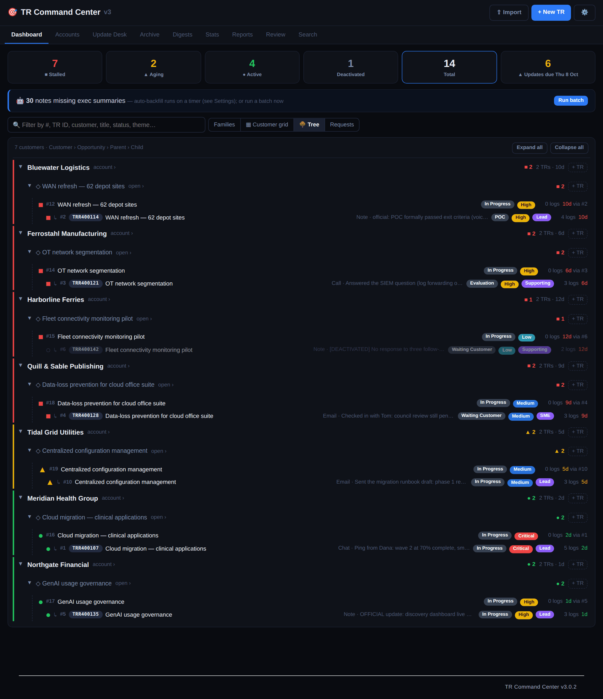</td></tr>
</table>

Give it one example of your TR IDs (say `TRR123123`) and tick the fields to
search. It finds each TR's ID in your notes, turns each title into an
opportunity under its customer, and gives every opportunity a parent with the
requests as its children. Review every row first; undo it afterwards if you
change your mind.

### On a phone

<p>
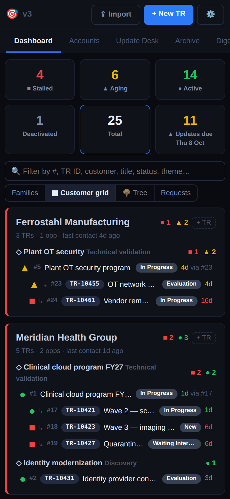
&nbsp;
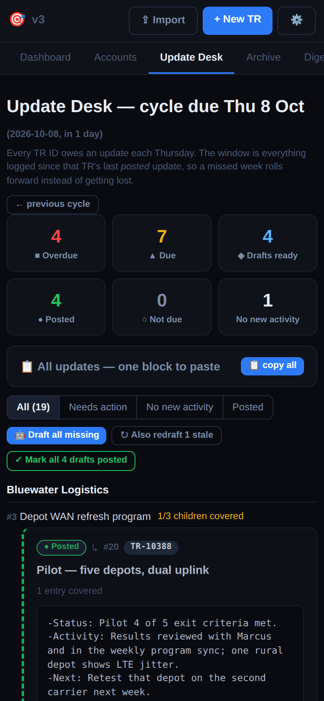
</p>

## Flavors

- **`main`** — vendor-neutral defaults: generic value themes, `official` as
  the official-record tag, and neutral demo data. Start here.
- **`palo-alto`** — the same app with Palo Alto Networks SASE defaults
  (Prisma Access / SD-WAN / ADEM themes, `sfdc` tag, SASE-flavored demo
  data) for SE teams in that ecosystem.

Only defaults and demo data differ — and every default is editable in
Settings afterwards anyway.

## Features

- **Request hierarchy** — Customer → Opportunity → TR → child TRs. Each TR
  carries its upstream **TR ID**; a child inherits its parent's customer and
  opportunity. One log can apply to several TRs (a call covering three child
  requests is recorded once and shows on all three)
- **Dashboard** — Green/Yellow/Red health per TR from last-contact age, grouped
  as families (a parent is green while any child is active), a customer grid,
  a collapsible customer → opportunity → parent → child tree, or Requests (the
  child and standalone TRs only); short `#N` handles and TR IDs, instant filter
  box, deactivation with archive countdown
- **Import** — paste rows from Google Sheets / CSV (or free text, read by the
  local model); columns are mapped for you and editable, the preview shows
  every TR, log, customer and opportunity before anything is saved, a repeat
  paste only adds what is new, and an applied import can be undone
- **Accounts** — the customer → opportunity → TR tree, with rename/merge for
  duplicate customer names and per-level pages
- **Update Desk** — every TR ID owes an update each cycle (default: every
  Thursday). Shows what is overdue, due, drafted, posted, or quiet; drafts
  combine everything logged **since that TR's last posted update** into one
  status (AI or plain), editable before posting; one block to copy/paste into
  your tracking system, and "Mark posted" records it on the TR
- **Summary to date** — on demand for a TR, a parent + its children, an
  opportunity, or a customer. Versioned (every run kept) and incremental: later
  runs revise the previous summary with only what is new
- **🚩 Flagged logs** — a flagged interaction is never passed to any model
  (summaries, drafts, reviews, digests, embeddings); flagging clears AI text
  already derived from it
- **Audit trail for opportunity moves** — on the TR, on each child (via its
  parent), and on the opportunity page
- **Inline editing** — status, priority, outcome, and role change in place on
  the TR page; logging happens without leaving it
- **Interaction log** — paste raw notes of any size (calls, meetings,
  transcripts); the local model produces customer-facing versions and terse
  exec summaries on demand, with an auto-backfill scheduler for the backlog
- **Audit trail** — every change to status/complexity/priority/role/outcome/
  themes is recorded automatically; each TR shows its full shift history
- **Catch-me-up digests** — per-TR AI summary (the TR-level summary to date),
  auto-generated on archival, listed on the Digests page
- **Period reports** — deterministic portfolio stats for any date range +
  optional AI narrative; every narrative run is saved to the Reports page
- **Review engine** — ask up to 10 free-form questions ("where could I have
  improved?") against a scoped slice of the record: date range, role type,
  themes, or hand-picked TRs (`3, 5, 9-12`). Grounded, persisted, reusable
  for self-evals / 6-month reviews / retros
- **Search** — instant FTS5 text search plus semantic search over notes via
  local-model embeddings (in-page explainer covers when to use which)
- **Activity snapshot** — last-7-days plain-text roll-up on the Reports page

## Quick start

### Docker (recommended)

```bash
cp .env.example .env   # point AI_URL at your local model server (or ignore — see AI-free mode)
docker compose up -d --build
# http://localhost:3000 — seeds demo data on first run
```

The SQLite database lives on the `trr-data` named volume. Set
`SEED_ON_EMPTY=false` to start empty instead of with demo data.

### Dev

```bash
npm ci
npm run dev        # http://localhost:3000
npm test
```

### Configuration (environment)

| Variable | Default | Purpose |
|----------|---------|---------|
| `PORT` | `3000` | HTTP port |
| `DB_PATH` | `data/trr.db` | SQLite database file |
| `AI_URL` | `http://localhost:11434` | Your local model server (Ollama, LM Studio, llama.cpp, vLLM…) — the only external call the server ever makes. Protocol auto-detected; `OLLAMA_URL` accepted as a legacy alias |
| `AI_MODEL` | `gemma4-16k:latest` | Fast model: per-note exec summaries |
| `AI_DIGEST_MODEL` | `gemma4:26b` | Quality model: digests, reports, reviews (falls back to the fast model on GPU OOM) |
| `AI_EMBED_MODEL` | `nomic-embed-text` | Embeddings for semantic search |
| `SEED_ON_EMPTY` | `true` | Seed demo data when the database is empty |
| `TZ` | `UTC` | Time zone for update due days (e.g. `America/New_York`) — set it so "Thursday" means your Thursday |

Everything else is configured **in the GUI** under ⚙️ Settings.

### Reference setup

Built with **Ollama** in mind and verified end-to-end against it (both the
native and OpenAI-compatible APIs). Reference models during development, on
a single 16 GB consumer GPU:

- **`gemma4-16k`** (12B-class, 16k context) — per-note summaries, and the
  automatic fallback when the big model doesn't fit
- **`gemma4:26b`** — digests, period reports, and the review engine (best
  quality; on 16 GB it only fits when the GPU is otherwise idle, which is
  exactly why the OOM fallback exists)
- **`nomic-embed-text`** — semantic-search embeddings

Anything comparable works: a fast mid-size model for summaries, the largest
model your hardware fits for digests/reviews, and any embedding model.
LM Studio and friends are first-class via the OpenAI-compatible API.


### Context windows & scale

The single most important setting, and the least obvious: **Ollama does not size
the context window to your prompt.** Without an explicit `num_ctx` it uses the
model's built-in default — often 2–4k tokens — and *silently discards* whatever
doesn't fit. The request still succeeds; you just get an answer based on a
fraction of what you sent. This app always sends `num_ctx` explicitly, taken from
**Settings → Context budget**, so set it to something your models can actually hold.

| Setting | What it does |
|---|---|
| Quality model context | Window requested for digests/reviews (`num_ctx`) |
| Fast / fallback model context | Same, for the smaller model used on OOM fallback |
| Reserved for answer + scaffolding | Held back per call for the prompt and the reply |
| Max model calls per review run | Guard rail — an oversized run is refused, not silently started |

To raise the ceiling in Ollama, bake a window into a model variant (this is
exactly what a `-16k` / `-128k` style tag is):

```bash
printf 'FROM gemma4:26b\nPARAMETER num_ctx 32768\n' > Modelfile
ollama create gemma4-32k -f Modelfile
```

…or point Settings at a long-context model you already have and set the token
count to match.

**But a bigger window is not the scaling strategy.** VRAM cost grows with
context — a very large window can cost more memory than the weights — and long
prompts get slower and less accurate ("lost in the middle"). So the review
engine **chunks instead**:

- Records are packed into slices sized to your configured window.
- Each question is **mapped** over every slice to pull only relevant evidence.
- Those findings are **reduced** into one answer per question (consolidating in
  rounds if the evidence itself overflows).
- Deterministic stats — counts, win/loss, per-status totals — are computed in
  code and passed whole, so **no number is ever lost to slicing**.

Volume is therefore bounded by *time*, not by context size: 10× the records is
10× the slices, not an impossible prompt. A bigger window just means fewer
slices and a faster run. If the whole scope happens to fit one window, the map
pass is skipped and it's a single call per question.

Before each run the UI shows the plan — records in scope, slices, and total model
calls — and the run executes in the background with live progress, because a
large sweep is minutes-to-hours, not seconds.

**Rules of thumb**

- Start at 16k; raise only when you have VRAM headroom to spare.
- Fewer, larger slices = fewer calls = faster — until VRAM or answer quality suffers.
- Narrowing scope (date range, TR numbers, role, theme) beats brute force every time.
- A run refused for exceeding the call budget is the guard rail working. Narrow
  the scope, or raise the limit deliberately.


## Make it yours — Settings as the use-case dial

"Technical Request" deliberately means whatever you need it to mean. The
taxonomies that drive every form, filter, stat, and review scope are editable
in **Settings → Taxonomies**, so the same tool fits different workflows:

**Pre-sales SE tracking** *(the defaults)*
- Statuses: `New → In Progress → Waiting Customer/Internal → POC → Evaluation → Closed Won/Lost → Archived`
- My roles: `Lead / Supporting / SME / POST` — role type is a review-engine
  scope, so "pre-sale vs post-sale work" is one checkbox
- Value themes: product/technology areas (multi-select per TR)

**Post-sales / delivery work**
- Statuses: `Scoping → In Delivery → Blocked → UAT → Hypercare → Complete → Archived`
- Closed statuses: `Complete, Archived` · Outcomes: `Delivered, Partial, Escalated, Churn Risk`
- Themes: service lines or workstreams

**Generic request / consulting tracker**
- Statuses: `New → Triage → Active → Waiting → Done → Archived`
- Roles: `Owner / Contributor / Reviewer` · Themes: practice areas, clients, or tech domains

Two settings make status renames safe: **Closed statuses** tells the app
which of *your* statuses mean "closed" (drives the Archive tab and health
math), and **Archived status** names the one that triggers the automatic
catch-up digest. Existing TRs keep their stored values if you edit a list.

Also in Settings: health thresholds (green/yellow days, archive window),
the auto-backfill timer, model selection per job, and every prompt template
(summaries, digests, self-eval, review engine) — so tone and grounding rules
are yours to tune.

## Backups & restore

> **Upgrading an existing deployment?** See [UPGRADE.md](UPGRADE.md) — your data
> lives on the `trr-data` volume, so rebuilds are safe as long as you never
> delete that volume. Back up first, then `git pull` + `docker compose up -d --build`.

**Settings → Backups & restore** manages full-fidelity snapshots of the
SQLite database (every TR, note, digest, report, review, setting, and
search index — made with `VACUUM INTO`, safe while running):

- **Back up now** — creates a snapshot; each one is downloadable
- **Daily auto-backup** — on by default, with a configurable retention count
- **Restore** — upload a `.db` file or click restore on a stored backup.
  The snapshot is validated, a safety copy of the current database is kept,
  and the swap happens on restart (automatic under Docker/systemd)
- **JSON export** — a portable dump of everything, for scripting or migration

### Recommended practice

1. **Leave daily auto-backup on.** It protects against mistakes — a deleted
   TR or a bad bulk edit is one click from undone (and even a restore keeps
   a safety copy of what it replaced).
2. **Get copies off the box.** Backups live next to the database
   (`data/backups/` on the Docker volume), so they survive mistakes — not a
   dead disk. Every backup is a plain file at a stable URL, so automate it
   from any machine that can reach the app:

   ```bash
   # grab the newest backup (cron-friendly)
   name=$(curl -s http://localhost:3000/api/backups | jq -r '.backups[0].name')
   curl -sO "http://localhost:3000/data/backups/$name"
   ```

   Or bind-mount `./data` instead of a named volume and point
   rsync/restic/Syncthing at `data/backups/`.
3. **Keep `.env` with your off-box copies.** The model-server URL and port
   live there, not in the database — it's the only thing a backup doesn't
   carry.

### Recovery

- **Deleted something?** Settings → Backups → ♻️ restore on the newest
  snapshot. The app restarts and you're back.
- **Lost the host?** Install trcc anywhere (`docker compose up -d --build`),
  open Settings → ♻️ Restore from file, upload your off-box `.db`.
  Everything returns — data, taxonomies, templates, settings.

## AI-free mode

Untick **Settings → Enable AI features** and the app runs with no local
model server at all: AI buttons and panels disappear, AI endpoints are
server-side blocked, semantic search falls back to text search, schedulers
idle. Tracking, health dashboard, audit history, FTS search, stats, weekly
reports, and all previously generated digests/reports/reviews keep working.
Flip it back on any time.

## Architecture

```
src/
  server.ts        Express app + auto-backfill scheduler
  config.ts        env-driven runtime config
  types.ts         domain model + default taxonomies
  db/              better-sqlite3: versioned migrations, repo, seed
  services/
    ai.ts          local model client (Ollama-native + OpenAI-compatible APIs, auto-detected) + GPU-OOM fallback
    digest.ts      deterministic period stats + per-TR digests
    review.ts      scoped, grounded review engine
    search.ts      FTS5 + embedding-based semantic search
  views/           server-rendered pages (template literals, escaped)
  routes/          pages (GET), actions (forms/htmx), api (JSON)
public/
  vendor/          htmx + Alpine, hash-pinned (see VENDOR.md)
  css/app.css      the entire design system, mobile-first
```

Data: SQLite with FTS5 triggers and versioned migrations. JSON API at
`/api/export`, `/api/trrs`, `/api/trr/:id`, `/api/digest`, `/api/reports`,
`/api/models` for scripts and automation.

## Security model

There is deliberately **no auth**: the network is the boundary. Run it on
localhost, a LAN, or behind a VPN/access proxy. Do **not** expose it directly
to the internet.

## License

Apache-2.0 — see [LICENSE](LICENSE).
